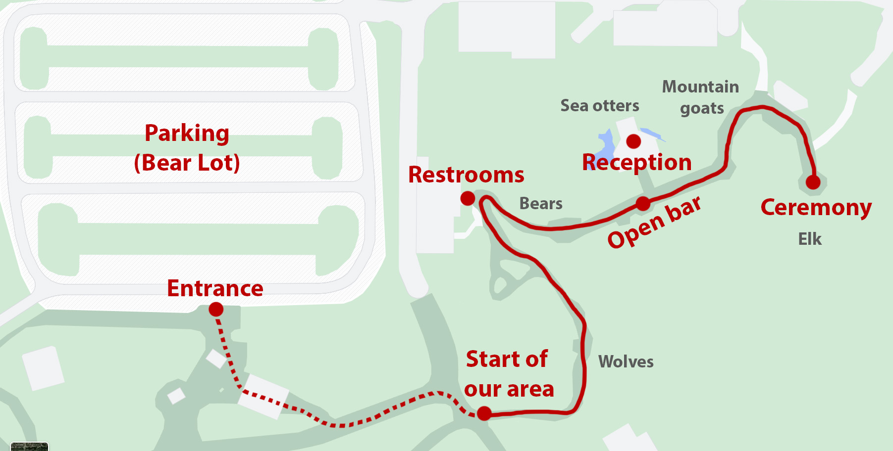

# The wedding ceremony and reception

The event itself takes place at [Woodland Park Zoo](https://www.zoo.org/). It's a big place -- come to the [Bear Parking Lot](https://goo.gl/maps/kZCgSavnzkApNWCt9) (here are some [directions from the Zoo people](directions_to_parking.pdf)) and you'll enter [at the Bear Entrance](https://maps.app.goo.gl/8Tae6WihHTc5fsAB8).

The Zoo will let guests in at 6pm. **The ceremony starts promptly at 6:30pm**, so we can catch the last of the sunlight! Then, we'll have a cocktail reception, and move to dinner at the Otter House. The total walk from the entrance to the ceremony is about 400m or a quarter of a mile.

### Schedule

|  |  |
|---|---|
| 6:00 | The Zoo opens ! Come in at the entrance [on the south side of the Bear Lot](https://www.google.com/maps/@47.6707843,-122.351973,3a,63.7y,171h,82.69t/data=!3m7!1e1!3m5!1sJ93T13E1hqeSwUseDgei_A!2e0!6shttps:%2F%2Fstreetviewpixels-pa.googleapis.com%2Fv1%2Fthumbnail%3Fpanoid%3DJ93T13E1hqeSwUseDgei_A%26cb_client%3Dmaps_sv.tactile.gps%26w%3D203%26h%3D100%26yaw%3D86.80147%26pitch%3D0%26thumbfov%3D100!7i16384!8i8192). |
| 6:30 | The ceremony, at the [Elk Overlook](https://www.google.com/maps/place/47%C2%B040'15.8%22N+122%C2%B020'58.8%22W/@47.6710172,-122.3507088,19.5z/data=!4m6!3m5!1s0x0:0xe5cd9e10c9bb2f17!7e2!8m2!3d47.6710422!4d-122.3496741). |
| 6:50 | Meet our Owl Ambassador and have a cocktail ! |
| 7:30 | Dinner at the [Riverhouse](https://www.google.com/maps/place/47%C2%B040'16.0%22N+122%C2%B021'01.3%22W/@47.6710172,-122.3507088,19.5z/data=!4m6!3m5!1s0x54901448f659f9c3:0x1b928830cd6a959b!7e2!8m2!3d47.6711198!4d-122.3503424). |
| 10:15 | Last call for drinks at the open bar. |
| 10:30 | Thanks for coming ! Time to leave the zoo. |

Please stay on our designated trail. Check out the [map above](zoo_guest_map.jpg) -- the solid red line is our trail. If you need to leave the Zoo, you can do so through the same way we entered, and you'll be able to call one of the Zoo folk to let you back in.

### Dress code

Aim for something [semi-formal](dress_code.png)!

# Events before and after

Please let us know if you can make it to these events [by filling in this quick form](https://forms.gle/Bfav9MPNKW43p8mJ8)! We'd love to have you there.

### Dinner, Friday September 16th, at 7pm

Please join us for dinner at [Fiasco](https://maps.app.goo.gl/K4VzUQYjb3uMHy8z8), at 7pm, the night before the wedding.

### Brunch, Sunday September 18th, at 11:30am

We'd love to have you join us at [Little Water Cantina](https://maps.app.goo.gl/yQrPfururYWCMgwh7) at 11:30am the day after the wedding.

# The hotel

We booked a block of rooms at the [Courtyard by Marriot Seattle Downtown/Lake Union](https://www.marriott.com/en-us/hotels/seacd-courtyard-seattle-downtown-lake-union/overview/). Their phone number is 206 213 0100. Careful, there are a few other Marriotts in Seattle with similar-sounding names.

### Getting to the hotel from the airport

From SeaTac Airport, you can take, grab a shuttle, get a taxi, Uber, or Lyft, or use the Light Rail and other public transit.

- An Uber or Lyft will probably cost around $50 to $60. You'll have to head to the [3rd floor of the parking garage to a dedicated pick-up area](https://www.portseattle.org/sea-tac/ground-transportation/app-based-rideshare). After landing, follow signs for "App-based ride share". We usuallydo this as it's the least hassle.
- The [Premier Airport Shuttle](https://premierairportshuttle.com/reservations/?USERIDENTRY=CMLU20&LOGON=GO) needs to be reserved; it's about $26 per passenger.
- The Light Rail is the cheapest option and might be the fastest, depending on traffic, but it doesn't go all the way to the hotel. More info [here](https://www.portseattle.org/page/public-transit-link-light-rail). The Light Rail won't get you all the way to the hotel and you'll have to get a bus from University Street station.

# Our registry

If you'd like to spoil us with even more than sharing our day, thank you for encouraging our [endless kitchen madness](https://www.williams-sonoma.com/registry/chdcfbsqvb/registry-list.html). We love cooking and baking !

# Questions

If you have any questions, or any dietary requirements we don't yet know about, please let us know at [quentincaudron@gmail.com](mailto:quentincaudron@gmail.com) or [hannahheyrich@gmail.com](mailto:hannahheyrich@gmail.com).
